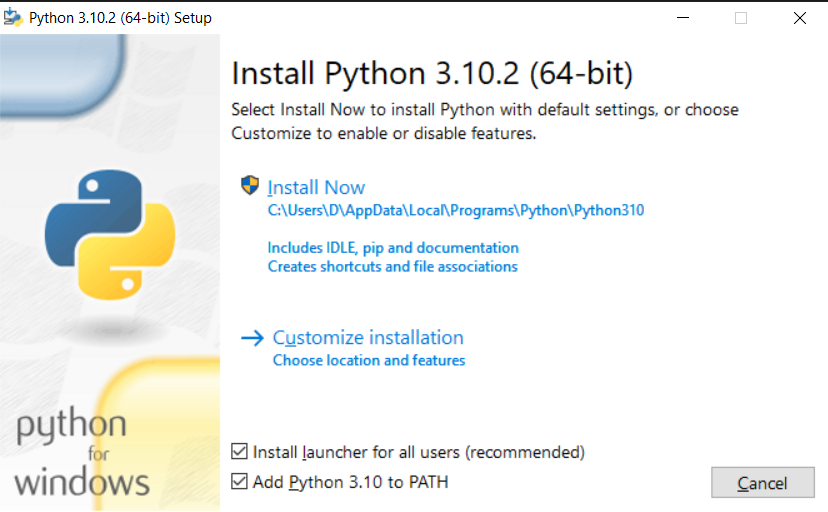

# Learn Programming with Python

This tutorial is going to assume you are using Windows 10 because it is originally written for my friend and he uses Windows 10 :)

## Install Python

First thing's first, go [download Python](https://www.python.org/downloads/).

Once the installer has downloaded, run it. You will see a screen like this: 

Make sure `Install launcher for all users (recommended)`, and `Add Python 3.10 to PATH` are selected.

Then go ahead and press `Install Now`. After the installation runs it will prompt you to `Disable path length limit`, do so. Once that is done you can close the window.

## Ensure Python is Installed and on your PATH

If you already have PowerShell running, close it. That's important - seriously.

From the Start menu, search for and open Windows PowerShell. You will see something like:

```powershell
Windows PowerShell
Copyright (C) Microsoft Corporation. All rights reserved.

Try the new cross-platform PowerShell https://aka.ms/pscore6

PS C:\Users\username>_
```

Enter the following

```powershell
python --version
```

You should see something like this

```powershell
PS C:\Users\D\username> python --version
Python 3.10.2
```

If you do not see this message, you have either not installed Python correctly or it is not on your PATH.

## Install Visual Studio Code

We are also going to [download VS Code](https://code.visualstudio.com/).

Once it is downloaded, run the installer. It should be fairly straightforward. If the installer prompts you to, I recommend registering VS Code as your default editor for basically everything, and enabling "Open with VS Code" on right click for both files and directories.

You have now installed Python and VS Code and are ready to continue to Week 1's lesson. It can be found in the Week1 folder above.
